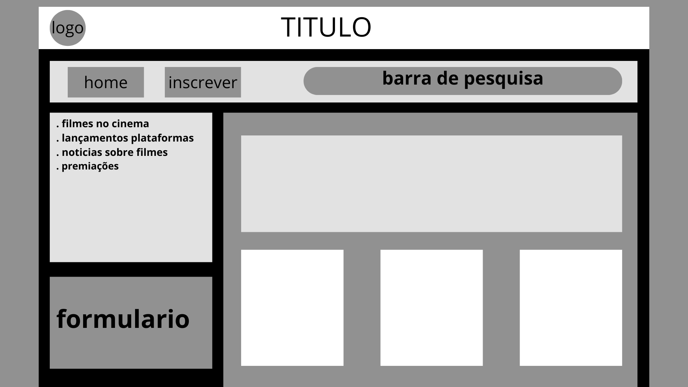
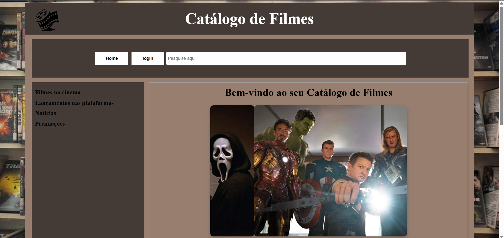
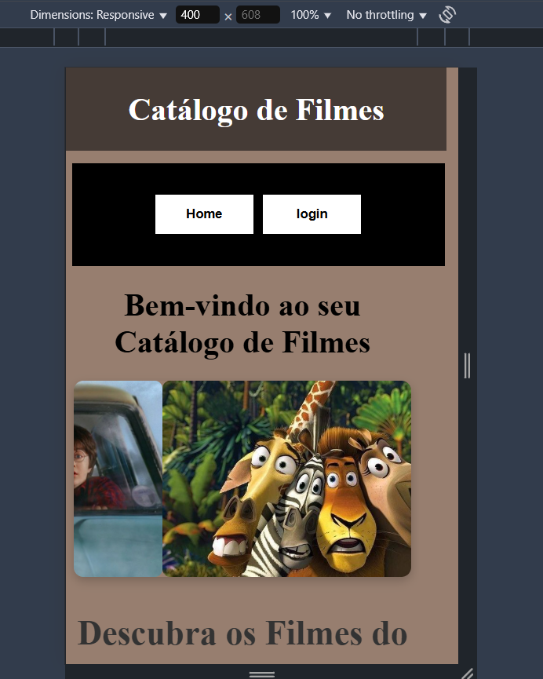
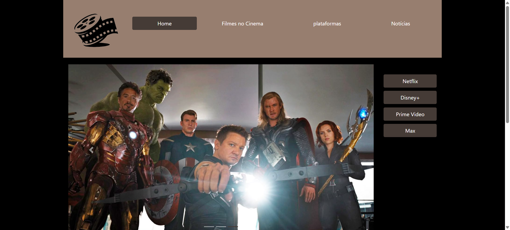
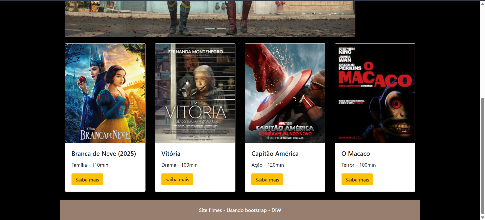

# Trabalho Prático - Semana 03

Dessa vez, vamos escolher uma proposta de projeto para trabalhar. Na [lista de propostas de projetos](propostas-projetos.md), escolha um dentre as alternativas.

Nessa atividade, você deverá montar a página inicial do projeto escolhido, a organização do HTML aplicando semântica correta e uso aprimorado do CSS. Leia o enunciado completo no Canvas para mais detalhes.

**IMPORTANTE:** Você deve trabalhar e alterar apenas arquivos dentro da pasta **`public`**. Deixe todos os demais arquivos e pastas desse repositório inalterados. **PRESTE MUITA ATENÇÃO NISSO.**

## Informações Gerais

- Nome: Emanuelle Barbosa Henrique
- Matricula: 889049
- Proposta de projeto escolhida: Catálogo de Filmes
- Breve descrição sobre seu projeto: Escolhi o projeto de catálago de filmes, pois é um assunto que eu gosto e acho mais fácil de falar. Minha ideia foi colocar notícias, filmes no cinema, premiações, lançamentos em plataformas e sobre filmes em geral. Tudo organizado atraves de tela interligadas.

## Print do esboço criada

## Print da home-page criada

## Print da home-page css puro

## Print da home-page bootstrap

